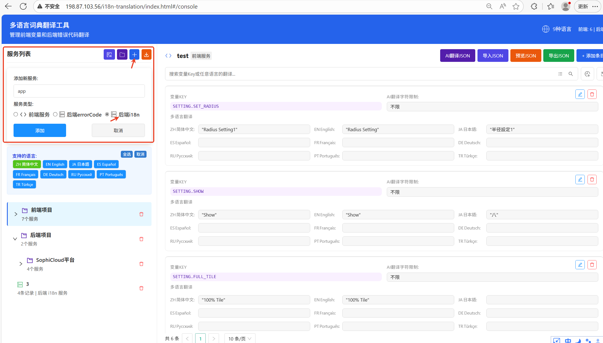
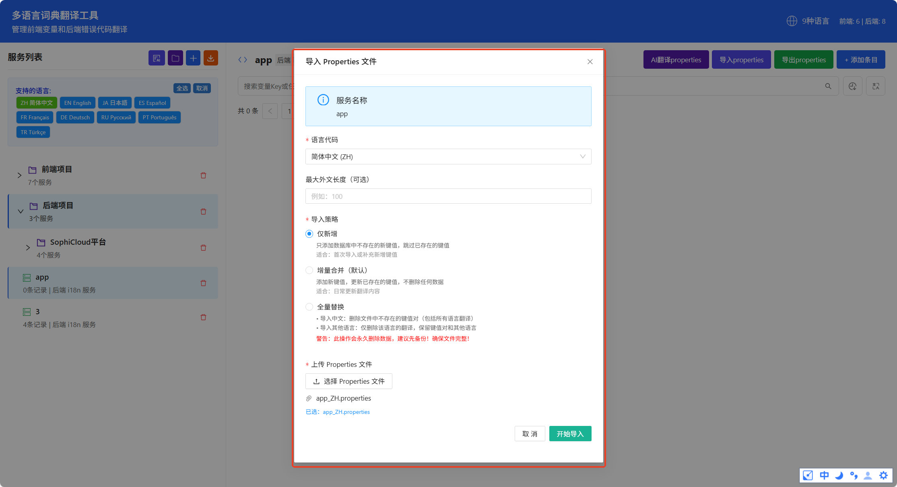
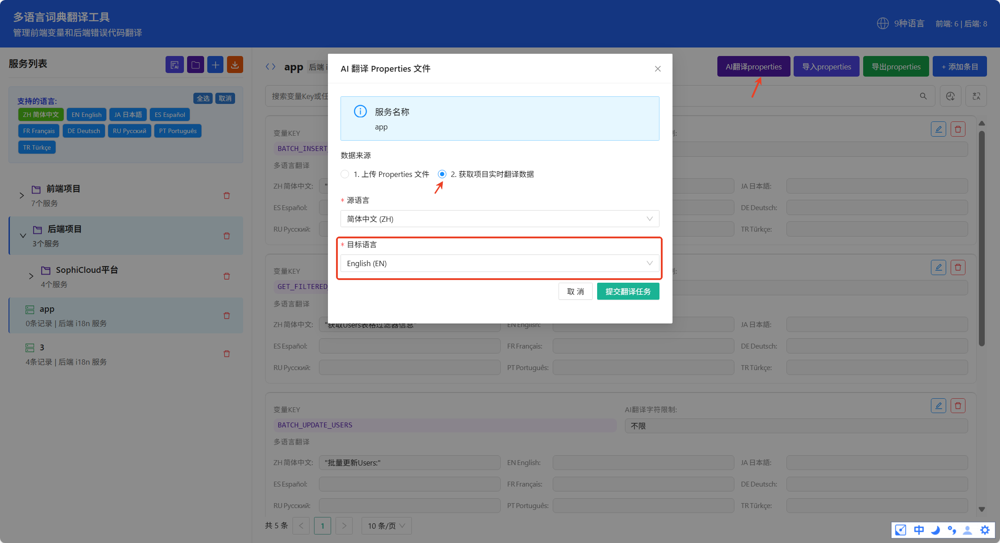
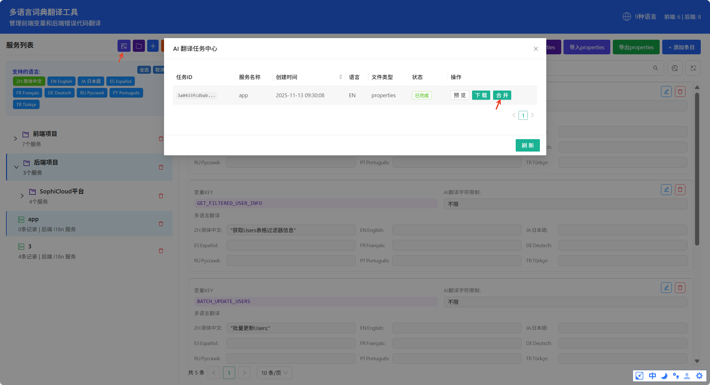
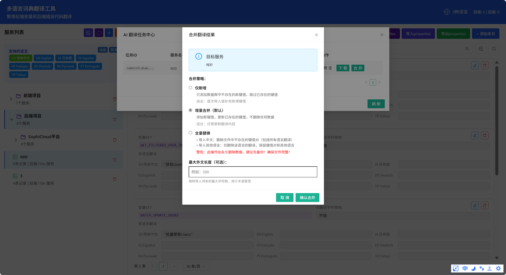
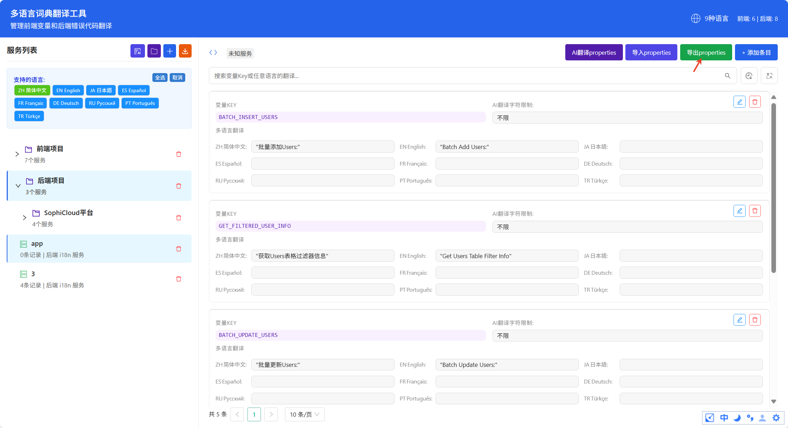
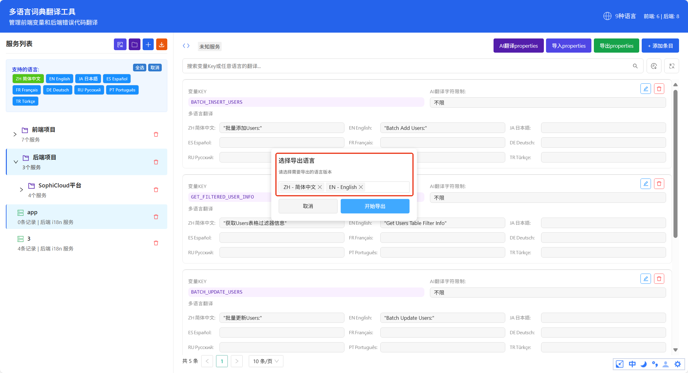
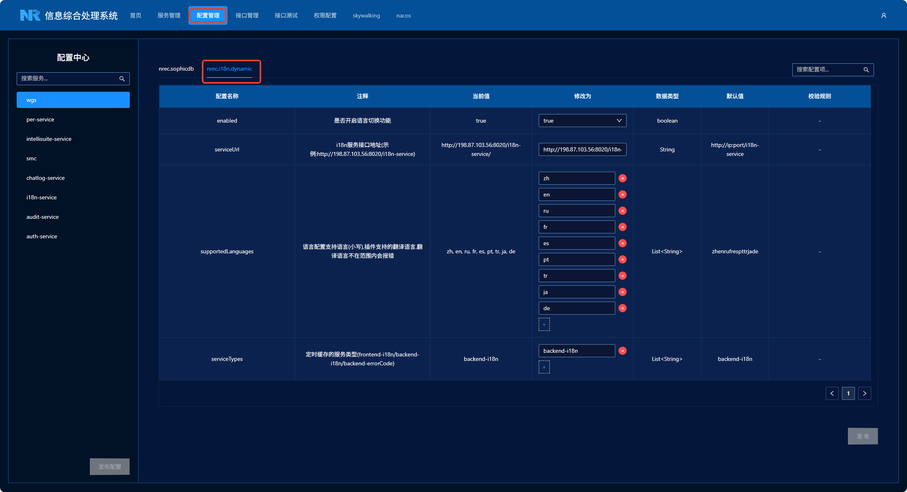
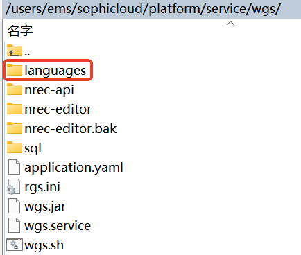
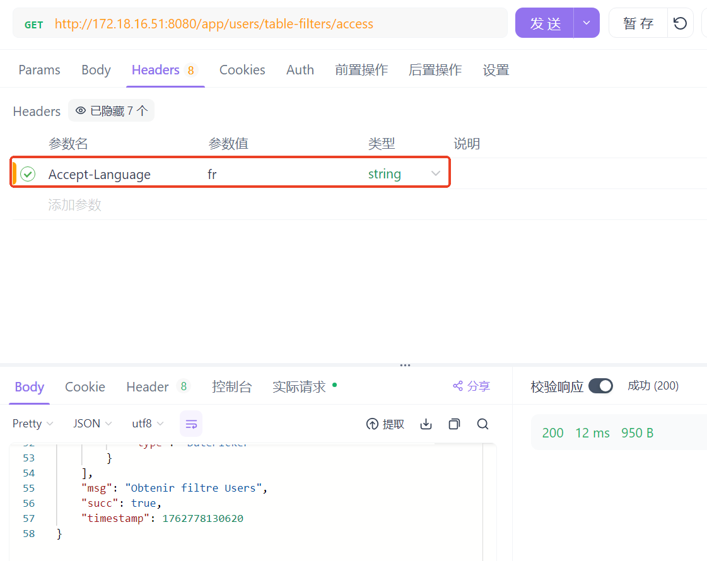

### i18n语言动态切换插件使用说明
#### 配置方法
支持file/cache/redis三种方式
- file：读取本地语言配置文件
- cache：定时刷新翻译信息到本地缓存，需要部署i18n服务
- redis：首次获取时存缓存，同步更新（i18n服务修改同步更新redis缓存），需要部署i18n服务
  如果cache和redis方式报错，采用file方式进行兜底，错误信息查看日志

**获取翻译配置**:访问i18n服务翻译网页http://ip/i18n-translation/index.html#/console
1. 添加后端服务
  
2. 导入翻译内容的中文properties文件
  
3. 添加ai翻译，选择获取项目实时翻译数据，选择目标语言
  
4. 点击翻译中心，找到对应翻译任务，点击合并
  
5. 将翻译结果进行合并
  
6. 点击导出properties文件
  
7. 选择需要导出的语言，导出压缩文件，在服务的语言配置目录(默认为languages)下进行解压，cache和redis方式不需要导出，翻译完成即可
  

**动态配置**：加载到配置中心中可以实时更新(需要部署smc服务，引用配置中心依赖，详细见[微服务配置中心 | WIKI](http://sophicloud.nrec.com/wiki/pages/service-config-center/#%E7%8E%B0%E7%8A%B6))，在smp页面的配置管理进行更新


注意这些配置项如果不改变默认值，不需要配置，实际正常情况也不需要配置，用默认配置即可
```
nrec:
  i18n:
    #语言配置是否启用,默认不启用  
    enabled: false  
    dynamic:
      # i18n服务接口地址,默认从服务配置中心获取,如果设置service-url,按照设置值来  
      service-url: http://<i18n-service-host>:<port>/i18n-service
      # 支持切换的语言(小写),默认支持9种语言,如果超出这个范围会报错,可以修改 
      supported-languages:
        - zh
        - en
        - es
        - ja
        - fr
        - tr
        - ru
        - pt
        - de
      # cache方式,定时缓存的服务类型(frontend-i18n/backend-i18n/backend-errorCode),默认backend-i18n  
      service-types:
        - backend-i18n
```

**静态配置**: 需要手动更新yml文件，i18n服务导出的语言配置名称格式为name_ZH.properties，service-names中配置name就可以，如果不配置采用引用依赖的服务名称，这些配置项如果不改变默认值，不需要配置，实际正常情况也不需要配置，用默认配置即可
```
nrec:  
  i18n:  
    #语言配置读取方式(file:读取properties,redis:读取redis缓存,cache:读取本地缓存),默认为file  
    config-type: file  
    #语言配置加载路径,默认在服务文件夹下的languages文件夹中,自动创建  
    baseUrl: file:./languages/  
    #语言包服务名称,支持配置多个服务名(用","分割),默认采用引用依赖的服务名称,如果设置service-names,按照设置值来  
    service-names: app  
    #语言包编码,默认UTF-8,最好不改动  
    encoder: UTF-8  
    #缓存过期时间(用于file和cache方式),默认45分钟  
    expiredTime: 2700000  
    #缓存刷新时间(用于cache方式),默认30分钟  
    refreshCron: 0 0/30 * * * ?
```
采用redis方式引用依赖的服务需要设置redis配置
```
# redis单机配置
spring:  
  redis:  
    host: 127.0.0.1  
    port: 6379  
    password: Nr-9000

# redis集群配置 
spring:  
  redis:
    # redis密码
    password: Nr-9000  
    cluster:
	  # redis节点
      nodes:  
        - 192.168.1.101:7001  
        - 192.168.1.102:7002  
        - 192.168.1.103:7003  
      # 重试次数
      max-redirects: 3
```
**使用方式**

语言配置文件需要放在服务文件目录下的languages文件夹下,目前i18n相关bean的创建是基于languages目录下有没有properties文件来创建的,如果需要多语言切换要将对应的翻译文件解压到languages目录下


引入i18n插件组件
```
<dependency>  
    <groupId>com.nrec.base</groupId>  
    <artifactId>i18n-spring-boot-starter</artifactId>  
    <version>2.0.2-SNAPSHOT</version>  
</dependency>
```
#### 使用方式
前端请求：请求头中需要设置Accept-Language，目前支持的语言为
```
zh:中文
en:英文
ja:日文
tr:土耳其文
fr:法文
es:西班牙文
ru:俄文
pt:葡萄牙文
de:德文
```


**通过方法进行语言切换**
引入I18nMessageManager
```
@Resource
private I18nMessageManager i18nMessageManager;
```

使用i18nMessageManager获取翻译信息
```
// 翻译项key为常量名称,服务名在配置项中设置
String translation = i18nMessageManager.getMessage(key);
// 直接设置服务名称
translation = i18nMessageManager.getMessage(key, service);
// 获取常量翻译信息,常量类需要继承BaseI18nConstant
translation = i18nMessageManager.getMessage(baseI18nConstant);
// 支持常量翻译中添加变量"请等待 %s 秒",str是字符串
translation = String.format(i18nMessageManager.getMessage(baseI18nConstant), str);
// 获取错误码翻译,入参是Status,返回类型是Status,抛自定义异常时,可以直接使用
Status errorCode = i18nMessageManager.getMessage(SecurityConstant.Status.BAD_CREDENTIALS_ERROR);

// 获取服务所用翻译项JSON
JSONObject translations = i18nMessageManager.getMessages(serviceName);
```

BaseI18nConstant，主要用于常量获取翻译结果
```
public class MessageConstant extends BaseI18nConstant {  
	// BATCH_UPLOAD_IMAGE_SUCCESS是翻译项key
    public static final MessageConstant BATCH_UPLOAD_IMAGE_SUCCESS = new MessageConstant("BATCH_UPLOAD_IMAGE_SUCCESS ", "批量上传图片成功");
    public static final MessageConstant PLEASE_WAIT_SECONDS = new MessageConstant("PLEASE_WAIT_SECONDS", "请等待 %s 秒");
    protected MessageConstant(String key, String defaultValue) {  
        super(key, defaultValue);  
    }  
}

//使用：
String translation = i18nMessageManager.getMessage(MessageConstant.BATCH_UPLOAD_IMAGE_SUCCESS);
```

**使用注解对返回信息进行多语言切换**
注解参数
```
public @interface I18nTranslate {  
	//替换目标,默认为"I18N(key)",根据key获取翻译,如果没有翻译返回key
    String pattern()default "";
    //替换目标服务名,服务名(语言配置文件前缀),默认为当前服务/yaml中的service-names
    String[] services() default {};  
}
```
具体使用：services可以不用配置，如果配置范围需要在service-names中
```
@I18nTranslate(services = {"wgs", "auth-service"})  
@ApiOperation("测试i18n注解拦截")  
@GetMapping("/test")  
public Result<Object> testI18n(@RequestParam("key") String key) {  
    return Result.buildSuccess(String.format("I18N(%s)",key));  
}
```