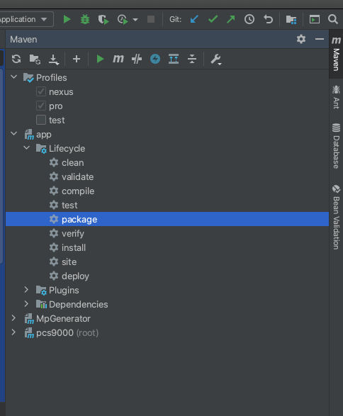

# pcs9000v2

#### 环境配置说明
------
通过maven的profiles激活不同环境，如下图所示:


默认激活pro标签

pro为生产环境，此时仅进行打包，将只打包bootstrap-pro中的配置，忽略bootstrap-test中的配置和所有application的配置

application-pro配置文件用于重命名为application.yaml作为服务器配置文件

test为本机开发环境，此时读取application-test配置文件和bootstrap-test中的配置
------
#### swagger 配置说明

```yaml
nrec:
  #swagger 配置
  swagger:
    #在线文档作者
    author: admin
    #作者联系人邮箱
    email: admin@nrec.com
    #接口简介
    description: App Server API
    #扫描基础包路径，一般指向 返回实体和控制层
    base-package: com.nrec.service.app.controller
```

------
#### 异常处理码 配置说明
```yaml
nrec:
  exception:
    #错误编码前缀，生产环境，如果有多个服务，需要区分开来.前缀从99递减
    code-prefix: 99
```

#### 服务名修改
修改服务名，将bootstrap-pro.yml和bootstrap-test.yml中的
```
spring:
  application:
    name: app
```
app修改为对应服务名

将pom.xml中出现的app修改为服务名

```
<artifactId>app</artifactId>
```

#### 服务目录介绍
```text
├─app	//该maven项目所有有关源代码
│  └─src	//项目所有资源目录
│      └─main	//项目主体结构
│          ├─java	//源代码目录
│          │  └─com
│          │      └─nrec
│          │          └─service
│          │              └─app
│          │                  ├─aop	//存放切面类文件	
│          │                  ├─config	存放配置类文件
│          │                  ├─constants	//存放定义常量的文件
│          │                  ├─controller	//存放控制层文件
│          │                  ├─entity	//存放实体类文件
│          │                  ├─mapper	//和dao层类似,在使用Mybatis时的常用包名
│          │                  ├─model	//存放模型类文件
│          │                  │  ├─dto	//存放数据传输对象模型文件，通常可以理解为Service层向外传输的对象
│          │                  │  └─qo	//查询对象，Controller层接收上层参数模型。注意超过 2 个参数的查询对象必须要封装，禁止使用 Map 类来传输。
│          │                  ├─properties	//存放自定义配置实体类文件
│          │                  ├─service	//存放服务层文件
│          │                  │  └─impl	//存放服务层实现类文件
│          │                  └─utils	//存放工具类文件
│          └─resources	//所需资源目录
├─doc	//与该项目有关文档
│  └─resources	//该项目有关资源文件
└─MpGenerator		//代码生成模块
    └─src	//maven项目主结构
        └─main
            ├─java	//代码自动生成启动类目录
            └─resources	//代码自动生成依赖资源文件
```