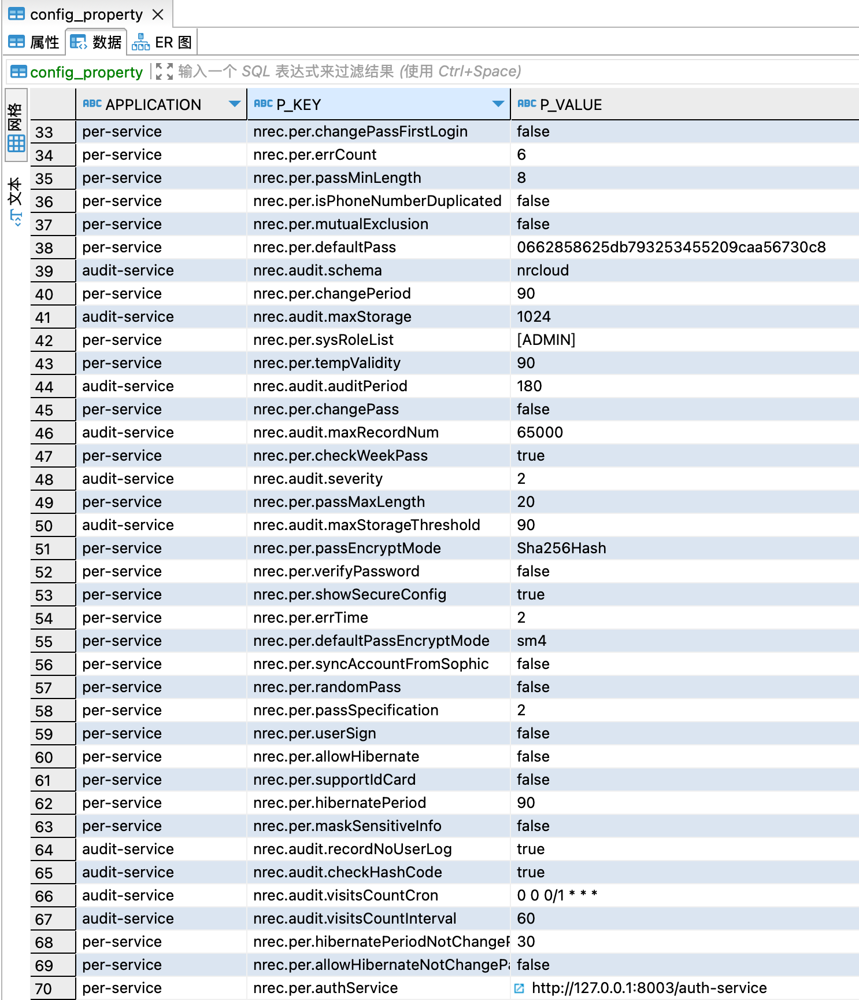
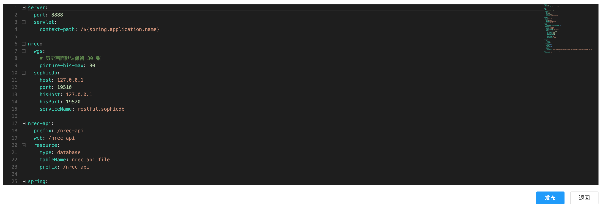
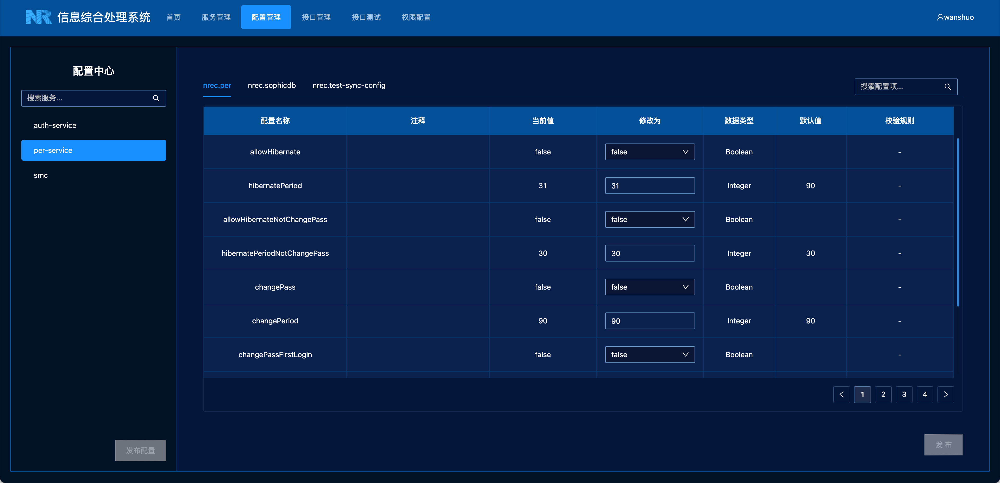
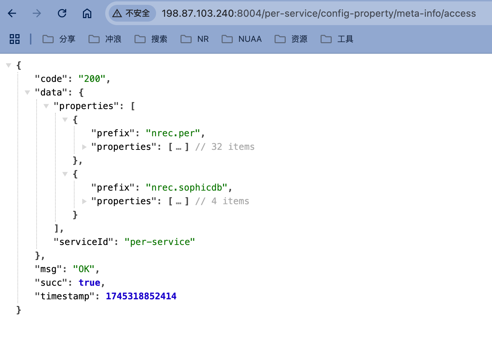

# 微服务配置中心

[TOC]


## 现状

微服务中通常会有很多配置。例如权限服务，有密码有效期、是否允许账户休眠、密码复杂度登配置。

以前如果要修改这些配置，会比较麻烦。如果注册中心使用的是 eureka，那么就要去修改 config_property 表，修改完后还要重启服务。




如果注册中心使用的是 nacos，就相对 eureka 简单一些了，只需要去配置中心修改配置，然后点击发布，就可以了，不再需要重启服务。



eureka 架构下，配置是统一存储在数据库中，nacos 架构下，配置可以直接存储在 nacos 中并在 nacos 中在线修改和发布。

nacos 带有配置中心的功能，确实好用，但是实际项目中我们使用 nacos 架构并不多，用的最多的还是 eureka 架构。

但是 nacos 也不是完美的，nacos 可以让我们直接编辑 yaml 配置文件，但是用户可能并不知道这个配置的含义，如果配置上没有加上注释说明，那么用户可能也不知道要怎么配置。并且 nacos 也不支持参数校验的功能，例如有一些配置不能配置成负数，有的配置只能填写限定的几个枚举值。

所以需要一个统一的配置中心，这个配置中心，能够兼容 eureka 和 nacos 两种架构。具备 nacos 的在线配置和发布的优点，并且弥补其参数校验和注释的不足。

|                  | eureka            | nacos | 配置中心 |
| ---------------- | ----------------- | ----- | -------- |
| 是否支持在线配置 | ×(在数据库中配置) | √     | √        |
| 是否支持在线发布 | ×(重启服务)       | √     | √        |
| 是否支持参数校验 | ×                 | ×     | √        |
| 是否支持配置注释 | ×                 | ×     | √        |



## 支持的数据类型

对于 Java 来说，配置中心支持如下数据类型：

boolean, int, byte, short, long, float, double 以及它们的包装类。

String 和 枚举类型。

`List<String>` 类型。(List 类型仅支持内容是 String)


## 接入配置中心

本节内容面向开发者。

配置中心是开放的，并且实现了插件化，任何微服务，如果有配置想要在线修改，都可以接入配置中心。下面会说明接入的流程。

### 1. 改造配置类

配置对应到微服务中，就是配置类。下面是一个典型的配置类：

```java
@Component
@ConfigurationProperties(prefix = "nrec.sophicdb")
@RefreshScope
@ApiModel("实时库rest接口配置")
@Data
public class SophicDbClientProperties {

  @ApiModelProperty("实时库rest接口部署的节点")
  @MatchPattern(pattern = {"^((25[0-5]|(2[0-4]|1\d|[1-9]|)\d)\.?\b){4}$"}, message = "请输入正确的IP地址")
  private String host;

  @ApiModelProperty("实时库rest接口的端口")
	@Range(min=1, max=65535, message = "端口号不能大于 65535")
  private Integer port;

  @NotNull
  @NotEmpty
  @ApiModelProperty("实时库rest应用向注册中心注册时的服务ID")
  private String serviceName="restful.sophicdb";

  @ApiModelProperty("xxx")
  private String urlPrefix="api";

}
```

其中，下面这三个注解，是强制要有的，并且 prefix 的值，必须要以 `nrec.` 开头

```java
@Component
@ConfigurationProperties(prefix = "nrec.sophicdb")
@RefreshScope
```

`@ApiModel("实时库rest接口配置")` 是这个配置类的描述。`@ApiModelProperty("实时库rest接口部署的节点")` 是对字段的描述。

下面的这些注解，都是参数校验的注解，如果这个配置需要进行参数校验，则可以使用 oval 库提供的注解进行描述。

```java
@MatchPattern(pattern = {"^((25[0-5]|(2[0-4]|1\d|[1-9]|)\d)\.?\b){4}$"}, message = "请输入正确的IP地址")
@Range(min=1, max=65535, message = "端口号不能大于 65535")
@NotNull
@NotEmpty
```

oval 依赖的坐标为：

```xml
<dependency>
  <groupId>com.nrec.base</groupId>
  <artifactId>param-valid-spring-boot-starter</artifactId>
  <version>${com.nrec.param.version}</version>
</dependency>
```


一个微服务可以有多个配置类，注册中心也是支持对多个配置类进行配置。


### 2. 引入配置中心插件

配置中心的功能，是插件化的。微服务只要引入配置中心插件，就可以在配置中心修改自己的配置。

如果注册中心使用的是 eureka，那么需要引入下面这两个插件（将配置存储在数据库中）：

```xml
<dependency>
  <groupId>com.nrec.base</groupId>
  <artifactId>config-controller-spring-boot-starter</artifactId>
  <version>${com.nrec.version}</version>
</dependency>

<dependency>
  <groupId>com.nrec.base</groupId>
  <artifactId>config-client-db-starter</artifactId>
  <version>${com.nrec.version}</version>
</dependency>
```

如果注册中心使用的是 nacos，则需要引入下面这两个插件（将配置存储在 nacos 中）：

```xml
<dependency>
  <groupId>com.nrec.base</groupId>
  <artifactId>config-client-nacos-starter</artifactId>
  <version>${com.nrec.config.version}</version>
</dependency>

<dependency>
  <groupId>com.nrec.base</groupId>
  <artifactId>config-controller-spring-boot-starter</artifactId>
  <version>${com.nrec.version}</version>
</dependency>
```

如果使用的是 nrec-service-cli3.2 版本的后端脚手架（将eureka和nacos集成到一块的后端脚手架），那么该模板已经默认引入了 eureka 版本的配置中心插件，默认将 nrec. 开头的配置存储到数据库中。（nacos 中 nrec. 开头的配置可以不用配置了，如果配置并发布的话，会和数据库中的配置冲突）

如何判断微服务的改造是否成功呢？

如下图，访问服务的这个接口：http://xxx.xxx.xxx.xxx:port/service-id/config-property/meta-info/access 如果这个接口能够正常访问并且会返回配置的元信息，则表示服务改造成功。

